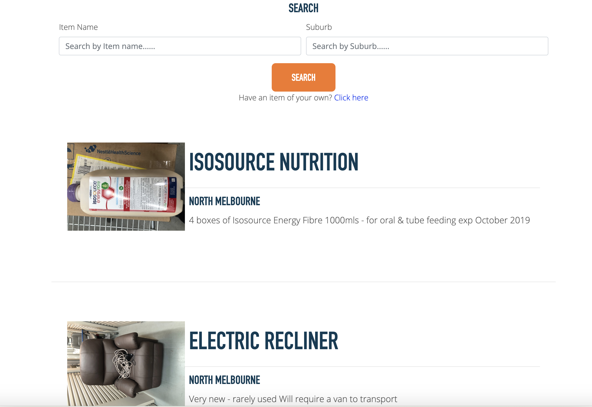
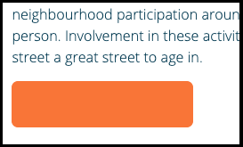
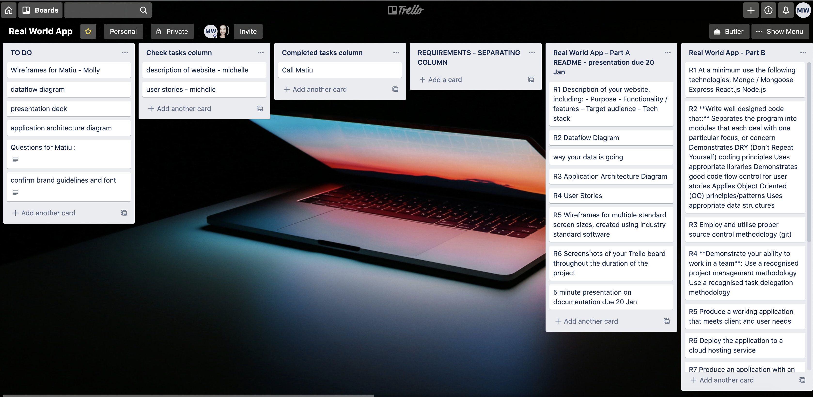
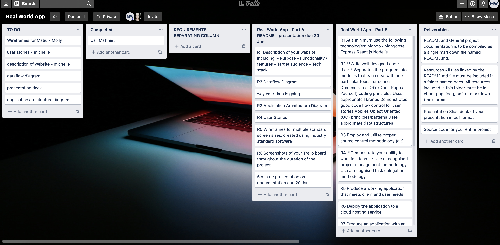

# Real World Application - One Good Street
A web app developed by Molly Madden and Michelle Wong

## R1	Description of your website

### Purpose

The purpose of this app is to refactor the website of One Good Street so that it is more accessible to senior citizens and stakeholders of senior citizens. We have been specifically tasked with improving the Library of Care Things section of the website to make it similar to a two-way marketplace. 

#### About the organisation
One Good Street is an organisation whose aim is 'to reduce social isolation and loneliness in older residents who live in our neighbourhoods through practical initiatives that everyone can get involved in.' There is currently a website that can be found [here](https://onegoodstreet.com.au/). It is run by Matiu Bush.

Presently the website has typical features such as a Navbar, a Home page, About page, Library of Care Things, Media & Events, Contact us, Find us on Facebook, Get Involved, and Admin login page. This site is currently built on WordPress. 

This is how the Library of Care Things currently looks.

#### Our main task - in connection with the purpose
After speaking to the client (Matiu Bush), we have been requested to focus on improving the Library of Care Things. The Library of Care Things is a page that connects those who have unwanted equipment (for example electric wheelchairs and walking frames) for senior citizens, to those who require such equipment. It is a free service offered by One Good Street and all equipment listed is free. Currently, people who want to offer equipment contact One Good Street and Matiu Bush picks up the equipment and then he lists them on the website. These listings are hard coded and it can be time consuming to list a single item onto the site. Matiu informed us he would like for the redesigned website to have the ability for visitors to list donated items themselves without the barrier of a forced sign up / log in. Once items are listed, Matiu also wants the ability to be notified of an item so he can review it before publishing.

As a result, our main task is to make the 'Library of Care Things' dynamic and link it to a database. 

There are also several issues around components being placed in a way that blocks text, and buttons lacking labels.

Sources: 
* https://onegoodstreet.com.au/about-one-good-street/

### Functionality / features 

#### Normal users 
Normal users encompasses non admin users (which will be discussed below). These users are people who may just browse the site passively as well as those who may be a more active participant.

##### Normal users viewing ability
* Normal users can view the Home, About, Library of Care Things, individual Library item page, Media & Events, Contact us, and Get Involved pages. 
* Normal users can view the home page to get a quick summary about what the website its about.
* Normal users can view the about page to understand the purpose and aim of One Good Street.

##### Normal users - more active role
* Normal users can use the contact us form to get involved or find out more about One Good Street initiatives.
* Normal users can sign up in order to offer help.

* Normal users can view all the listings on the 'Library of Care Things' and request an item by emailing the person who listed or Matiu.
* Normal users can search listings by title, location and category.
* Normal users can request items by using the contact details connected to the listed item. 

##### Normal users as donors
* Normal users can list items without signing up. In order to list an item, visitors would need to fill in a form. This form requires visitors to enter a title (string), description (string), category (drop down box), condition (drop down box), location (string) and contact details (string).
* The form will not be submitted unless all the fields are filled in. Once submitted, the form is saved to the Mongo database.
* Normal users who list items can provide their contact details (in the event someone wishes to contact them about requesting an item) or they can choose to not provide contact details, and in that event, 'One Good Street' would be the point of contact. 
* In terms of form validations for normal users, errors will be displayed if any part of the form is incomplete. 

#### Admin
* In addition to the functions that a visitor has, admin users can view, edit and update all pages and have CRUD functionality for the listings on the Library of Care Things.
* Admin users can add new categories and conditions to the listings, which will be saved to the Mongo database. This will be achieved via a form. 
* In terms of form validation, the administrator cannot submit a blank value when adding a new category or condition. 

### Target audience
The target audience of One Good Street senior citizens and stakeholders of senior citizens (including case managers, physiotherapists, occupational therapists, aged care and NDIS workers). 

#### Case Study

##### John Foo - has a shower stool to donate
John Foo has an elderly mother who used to live with him and had a shower stool. However, she has recently moved to an aged care home. As a result, she is no longer requiring the shower stool as this is already provided for at her new home. As a result, John decides to list this shower stool on the Library of Care Things through One Good Street. 

##### Jane Doo - Case manager for a senior citizen
Jane Doo is the case manager for a senior citizen, who is still living at home. Due to mobility issues, they are finding it more difficult to shower standing up and subsequently require a shower stool. Jane visited One Good Street and saw there was a shower stool available on the Library of Care Things. She was then connected to John.

The outcome is that John is able to dispose of his shower stool in a responsible and meaningful way while Jane's client is not burdened with the potential steep financial costs of purchasing aged care equipment and can reap the benefits of using John's unwanted equipment. 

#### Visitors
Those who visit the site and wish to see what it is about and get a feel if it is suitable for their needs. They may be visiting as they are interested in requesting equipment or donating items. They may also be interested in requesting or donating items on behalf of a relative or client. Visitors may also be wanting to help out as a volunteer and are seeking guidance about the skills or items they can offer. 

### Tech stack	GENERAL
The tech stack used for this app are:
* HTML
* CSS
* MongoDB
* Express
* React
* Node JS
* Heroku for deployment
* Netlify for deployment
* Amazon S3 Service 

## R2	Dataflow Diagram	CMP1043-4.2

Link to diagram Level 0 https://www.lucidchart.com/documents/edit/ece6f7b9-e479-4795-be97-72cf2278d02c/0_0

Link to diagram Level 1 https://www.draw.io/#G1rctgUMfcY5GOdSZ1WwNeayM1_JQZqplB

## R3	Application Architecture Diagram	CMP1043-4.3

Link to Lucid Chart https://www.lucidchart.com/documents/edit/82c229a8-0120-4702-9776-0ff7e80e8292/0_0

Sources:
* https://www.educative.io/edpresso/what-is-mern-stack 

## R4	User Stories	CMP1043-5.1

For our app, there are two main types of users - visitors, normal users and admin users.

### Normal user as passive browser
Epic: As a normal user I want to view the website to determine and understand the purpose of One Good Street, and view the listings of items to determine if I want to request or donate an item.

As a normal user, I want to view the individual listing pages of each item without signing up so I can easily view the title and image of items being donated.

As a normal user, I want to view the details of an individual item so I can ascertain if it is suitable for me.

As a normal user, I want to view contact information of the donor or Matiu Bush so I can contact him/her if I need to clarify any aspect of the item. 

As a normal user, I want to be able to help out if I wish, and this may include contacting One Good Street.

As a normal user, I want to have the option to fill out a Get Involved form in order to offer help. 

### Normal users as donors
Epic: As a normal user who wishes to donate, I want to post a listing for my item so it can be donated to a person in need. 

As a normal user, I want to post a listing with a title, headline, description, category, location, and image so the donee can see what they are requesting. 

As a normal user, I want to post a listing with contact details made publicly available so the donee can contact me if there are any questions. 

As a normal user, I want to have the option of posting a listing without making my contact details publicly available. In this case, One Good Street & Matiu Bush would be the point of contact.

As a normal user, I want the website to only display the detailed description of the item (including title, headline, description, category, location, and image) to people who may be interested in the item.

### Admin users
Epic: As an admin user, I want to have the ability to oversee listings in the Library of Care Things.

As an admin user, I want to be notified when a new listing has been created.

As an admin user, I want to view all listings so I can see what has already been listed.

As an admin user, I want the ability to create, read, update, or delete listings. 

As an admin user, I want visitors to use my contact details to be the point of contact if they do not wish to make public their personal contact details. 

Sources
* https://stormotion.io/blog/how-to-write-a-good-user-story-with-examples-templates/

## R5	Wireframes for multiple standard screen sizes, created using industry standard software	CMP1043-4.1, CMP1043-5.3

## R6	Screenshots of your Trello board throughout the duration of the project	CMP1043-5.2

### Trello
Trello was used to keep track of our project by listing the tasks we needed to do, the tasks we are working on, the tasks we have completed and other requirements for the assignment. Please see the screenshots of our trello board below. 

Trello 15-1-20

Trello 14-1-20

[Trello Board link](https://trello.com/b/xNTst2Dp/real-world-app)
